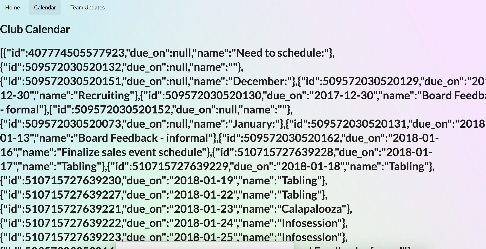

# EthiCAL Member Website

# Installation

Download [Node.JS](https://nodejs.org/en/)

Installing client dependencies
```
cd client
npm install
```

Installing server dependencies in the base directory
```
cd ..
npm install
```

# Launching

**Get an Asana Personal Access Token (PAT)**
 * Go to [My Profile Settings](https://app.asana.com/-/user_settings)
 * Open the **Apps tab**
 * Click **Manage Developer Apps**
 * Click **+ Create New Personal Access Token**


Add Environment variables
```
export ASANA_PAT={Insert Asana Personal Access Token From Above Here}
```
**Note**: Do **not** include the brackets when inserting your asana Personal Access Token.
**Note**: This only stores the access token for a single session so make sure to save your Personal Access Token elsewhere.

If you are on Terminal you can save the environment variable permanently by creating (or editing) a .bash_profile file in your home directory. Add the following line to the end of the .bash_profile and restart Terminal after saving.
```
export ASANA_PAT="Insert Asana Personal Access Token from Above Here"
```
**Note**: **Do** include the quotes when inserting your asana Personal Access Token. 

In the base directory (Current dir if you've been following along) and run launch command on port 5000
```
npm start
```

**Open a new terminal window** and go into the client folder and run npm start
```
cd client
npm start
```

Go to [localhost:3000](http://localhost:3000)

The username will be your Calnet ID (Berkeley email without the @berkeley.edu)

You can type in any password in the login screen

http://localhost:3000/home/calendar should look like this:


# Making Changes
Be sure to create a new branch with a (somewhat) descriptive name of what aspect of the website is being changed. After the changes are done, contact Andrew about merging the changes into the master branch. In the near future we'll probably make use of pull requests.

# Structure of Repository
The frontend part of the website is a React application that's stored in the folder `client`. The application uses an npm module called react-router to handle routes of the website.
* the login page and beginning routes of the React application is located in `client/src/App.js`.
* The main menu and home page is in `Dashboard.js`
* The different pages of the website are located in `client/src/components` where each folder is the name of each of the pages. Each folder contains an index.js and index.css file which are the javascript react components and the style of the page respectively.

The backend part of the website resides in the outermost directory of the repository and is an express application that communicates with Asana to fetch and post data and handle authentication of the website.
* The setup of the backend is in the file `app.js`
* The api endpoints are in the folder `api`


# A word on Style/CSS and Semantic Components
The website is a react application so it is all on one page. Therefore, when changing up certain HTML components, the changes will persist throughout the page. Use descriptive class names for elements that should only belong on certain pages of the website.

For tidy code, it is encouraged that for each of the pages, the styles for the page resides in the `index.css` file that corresponds with the page.

We also want to try our best to use Semantic UI react components specified in https://react.semantic-ui.com especially for dealing with grid layouts (Using the Grid Component). Override any of the styles of Semantic UI components can be sort of contentious. If your change is on a specific page, Make sure to make a unique classname for the semantic component you are overriding when declaring the component (Using the `className` argument) and use the !important in each style you will override. I (Andrew) am currently looking into [Stylized Components](https://www.styled-components.com/) to ease with overwriting semantic components.

# Deployment
Pushing to the deploy branch would redeploy the application on heroku
